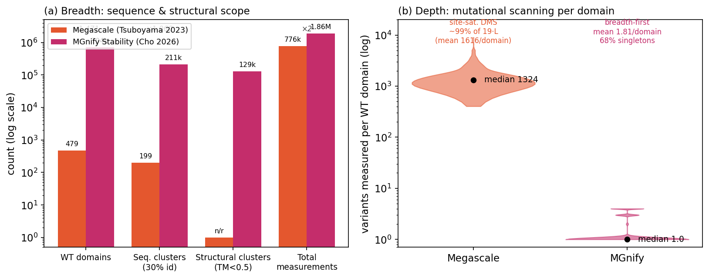
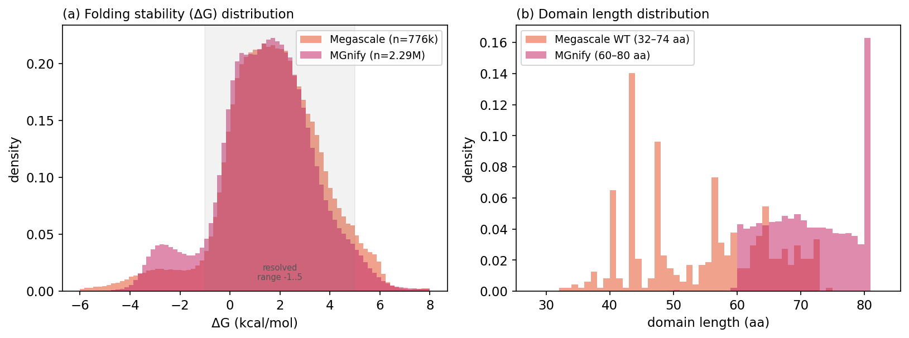

# Megascale vs. MGnify Stability：数据集对比与“能否替代”的实证分析

> 目标：对比 StaB-ddG 阶段 1 fine-tuning 使用的 **Megascale**（Tsuboyama et al. 2023）数据与 **MGnify Stability**（Cho et al. 2026，*Accurate protein stability prediction for small domains using mega-scale experiments*）数据，从 **(a) protein family / 结构覆盖广度** 和 **(b) 突变扫描深度** 等多个角度，用**真实数据分析**验证“MGnify 是升级版 Megascale、可完全替代 Megascale”这一初步结论。

---

## 0. 一句话结论（TL;DR）

**“MGnify 是 Megascale 的升级版”基本成立；但“完全替代”过强，应修正为“主导性取代 + 保留 Megascale 作为深度补充与独立 benchmark”。**

- ✅ **作为可泛化的 absolute-ΔG / ΔΔG 训练数据集**：MGnify 在序列与结构广度上比 Megascale 大 **~1000×**，并首次大规模测定**绝对折叠自由能 ΔG**。论文证据显示：单独用 MGnify 训练 > 单独用 Megascale 训练（ESM3 LoRA：**0.87 vs 0.73**），且 MGnify-trained 模型在 **Megascale 自己的点突变 benchmark** 上追平了用 Megascale 训练的 ThermoMPNN → **功能上可取代 Megascale**。
- ⚠️ **但不是“丢弃 Megascale”**：(1) 论文发布的**最佳模型**用的是 **MGnify+Megascale 合并**数据（0.89 > MGnify-only 0.87）；(2) Megascale 的 **near-saturation 深度突变扫描**（479 个结构域、每个 ~99% 的单点突变全测）是 MGnify“广度优先”设计**无法复制的独特资源**；(3) 两者都 **≤80 aa**、同一 cDNA proteolysis 限制——MGnify 在“蛋白尺寸”维度**并未升级**。
- 📐 **核心权衡**：Megascale = **窄而深**（few domains, deep DMS）；MGnify = **广而浅**（massive domains, shallow per-domain）。二者在“深度”维度**互补**，最佳实践是**并集**。



---

## 1. 背景：两个数据集是什么关系？

| | Megascale | MGnify Stability |
|---|---|---|
| 论文 | Tsuboyama et al., *Nature* **2023** | Cho, Tsuboyama, …, Ovchinnikov, **Rocklin**, bioRxiv **2026** |
| 实验方法 | cDNA display proteolysis | **同一方法** cDNA display proteolysis |
| 实验室 | Rocklin lab | **同一 Rocklin lab**（Tsuboyama 为共同一作） |
| 条件 | pH 7.4, 298 K, trypsin + chymotrypsin | **完全相同** |
| 角色 | StaB-ddG / ThermoMPNN 等的训练数据 | 明确定位为 Megascale 的**后继 / 扩展**（同一 pipeline 放大 ~1000×） |

> 关键点：MGnify **不是**一个不同来源/不同口径的数据集，而是**同一团队、同一实验方法**把测定规模从 ~80 万扩到 ~190 万、把蛋白来源从“几百个 PDB 小域 + de novo 设计”换成“MGnify 宏基因组的海量天然结构域”。因此两者**直接可比**，且“升级版”的说法在血统上是成立的。

---

## 2. 已下载的数据与模型权重（任务 1）

论文 *Data & code availability* 指向的 Zenodo 链接表面是一个 Google Form，但实际 Zenodo record **`10.5281/zenodo.19411306` 为开放获取（CC-BY-4.0），无需申请**。已自主下载：

**数据（保存在 `absolute-stability-predictor` 仓库 main 分支，`data/` 已被 .gitignore）：**
| 文件 | 大小 | 内容 |
|---|---|---|
| `230515_K50dG_dmsv4_dmsv5_dmsv7_concat260429.csv` | 2.23 GB | **完整 MGnify Stability 数据集**（dmsv4/5/7 合并，重标定 ΔG）|
| `mgnify_training_index.csv` | 138 MB | 训练用序列索引（含 train/test split + PDB_name 分组）|
| `dmsv4_filtered_train_splits.csv` | 60 MB | DMSv4 训练 split |
| `benchmarks.zip` | 872 MB | S1724 / ThermoMutDB / TED 等 benchmark |
| `README.md` | — | 数据字典 |

**模型权重（HuggingFace `Yehlin/absolute-stability`，公开非门控，`*.ckpt` 已 .gitignore）：** 12 个 LoRA checkpoint（ESM3ΔG ×6 + SaProtΔG ×6，base + augmented，各 3 个 ensemble），共 ~213 MB，已全部下载到 `esm3dg_weights/`、`saprotdg_weights/`。

**Megascale 数据**：已存在于本机 `…/worktrees/esm-replace/data/Processed_K50_dG_datasets/Tsuboyama2023_Dataset2_Dataset3_20230416.csv`（697 MB，776,298 行，Zenodo 7992926），直接复用。

> 未下载的大文件（非本次对比所需）：`figures.zip`、`dmsv7_analysis.zip`、两个原始 NGS count table、`scripts_to_calculate_K50_and_dG.zip`（合计 ~5 GB，按需再取）。

---

## 3. 多维度对比（全部基于本地真实数据计算）

下表中标 **[数据]** 的数字由本目录 `analysis/` 脚本在本地 CSV 上实算得到；标 **[论文]** 的为论文权威报告值（已尽量与实算交叉核对）。

### (a) Protein family / 序列与结构覆盖广度

| 指标 | Megascale | MGnify | 倍数 | 来源 |
|---|---:|---:|---:|---|
| 总测定条数 | 776,298 | 1,859,498（concat 实测 2,287,291 条）| ~2.4× | [数据]/[论文] |
| 野生型结构域数 (WT) | **479** | **704,424**（训练索引中 532,988 个 PDB_name）| **~1,470×** | [数据]/[论文] |
| 序列簇 @30% identity | **199** | **211,020** | **~1,060×** | [论文] |
| 结构簇 @TM-score<0.5 | 未报告（极少）| **129,303** | — | [论文] |
| 蛋白来源 | 数百个 PDB 天然小域 + de novo 设计 | **MGnify 宏基因组天然域**（1.88M 条 mgnify=True）+ 104k dark-matter 设计 | — | [数据]/[论文] |
| 三个寡核苷酸库规模 | — | dmsv4 813,652 / dmsv5 573,641 / dmsv7 899,998 | — | [数据] |

**结论 (a)**：MGnify 在“能覆盖多少种不同的蛋白”上对 Megascale 是**压倒性升级**——序列簇 ~1,060×、结构簇从“几乎没有报告”到 12.9 万。Megascale 论文自己也承认其 “limited structural diversity is insufficient to capture the full diversity of protein domain architectures, and likely too sparse to train accurate, generalizable predictors of ΔG”。这正是 MGnify 要解决的问题。

### (b) 突变扫描深度 —— 如何定义？

> **定义**：对一个长度为 *L* 的野生型结构域，其单点突变空间大小为 **19·L**。
> - **Site-saturation 完整度** = 实测的相异单点突变数 / (19·L)；
> - **每域变体数** = 该 WT 下实测的所有变体（含突变体/indel）条数。
>
> 深度高 ⇒ 数据能**完整刻画单个蛋白的突变-稳定性 landscape**，适合 ΔΔG、局部突变效应、epistasis、位点特异分析。深度低但广度高 ⇒ 适合学习**跨蛋白的绝对稳定性规律**。

| 深度指标 | Megascale | MGnify | 来源 |
|---|---:|---:|---|
| 每个 WT 域的变体数（中位/均值）| **1,324 / 1,616**（min 404, max 9,032）| **1 / 1.81**（max 4）| [数据] |
| Site-saturation 完整度（均值）| **99.1%**（中位 99.9%）| **≈0.09%**（≈mutants/(19·L)）| [数据] |
| 每个域被突变的位点比例 | **100%**（每个位点都测）| 绝大多数域 0 个突变位点 | [数据] |
| 每个位点平均测得的替换数 | **18.87 / 19** | ≪1 | [数据] |
| 仅有 WT、无任何突变体的域占比 | ~0% | **67.9%（单例）** | [数据] |

**结论 (b)**：这是两者最本质的差异。**Megascale 是近乎完整的深度突变扫描（DMS）**——对 479 个域，几乎把每个位点的 19 种替换全部测了（99%），平均每域 1,616 个变体。**MGnify 是广度优先**——67.9% 的域只有一条 WT 测量、平均每域仅 1.81 条、最多 4 条（WT + 3 个突变体）。

> 换言之：问“数据足不足够刻画”要分两层——
> - 刻画**单个蛋白完整的突变 landscape**：Megascale 足够（且更强），MGnify 不足；
> - 刻画**蛋白宇宙的绝对稳定性多样性**：MGnify 足够（且远超），Megascale 不足。

### (c) 变体类型覆盖（variant type）

| 类型 | Megascale [数据] | MGnify [论文/数据] |
|---|---:|---:|
| 单点替换 single-sub | 487,914 | 710,605 |
| 多点替换 (double / >2) | 210,118（合并计）| 150,095 + 1,889 |
| 插入 insertion | 50,643 | 149,832（[数据] 实测）|
| 删除 deletion | 25,275 | 145,775（[数据] 实测）|
| indel 合计 | 75,918 | **295,607 ≈ 论文 292,486** ✅ |
| 野生型 WT | 2,348 行（479 个唯一域）| 704,424 |

两者都覆盖 substitution + insertion + deletion。差别在于 **MGnify 的 indel 被专门构造成一个大规模 benchmark**（论文 Fig 3d：ESM3ΔG 在 indel 上 RMSE 仅 0.81，远超 Rosetta），而 Megascale 的 indel 更多是附带的（Gutierrez & Rocklin 2024 的稳定性 indel 子集）。

### (d) 测定的物理量：ΔG vs ΔΔG（概念升级）

- **Megascale** 虽含 ΔG，但因结构集太窄，过去主要被当作 **ΔΔG（点突变效应）** 训练源（ThermoMPNN、StaB-ddG 皆如此）。
- **MGnify** 在海量天然结构域上测**绝对 ΔG**，使训练**可泛化的 absolute-ΔG 预测器**第一次成为可能（SaProtΔG / ESM3ΔG）。这是从“预测突变的相对效应”到“预测蛋白的绝对稳定性”的范式升级。



两者 ΔG 分布高度重合（都集中在 ~1.5–2 kcal/mol、都落在 -1..5 的可分辨区间内）；MGnify 在 ΔG≈-3 处多出一个“未折叠的天然域”小峰（19.1% 为负 ΔG），反映其天然序列里有更多本就不稳定的域。

### (e) 结构域长度（一个关键的“非升级”维度）

| | Megascale | MGnify |
|---|---:|---:|
| 长度范围 | 32–74 aa（均值 54）| 60–80 aa（均值 71；含 indel 后最短 43）|
| 上限 | ~74 aa | **80 aa（硬上限）** |

**两者都局限于 ≤80 aa 的小域**。MGnify 把长度上推到 80 并更集中在 60–80，但**没有突破“小域”这一根本限制**。论文 Fig 4 明确指出模型对 >80 aa、ΔG>10 kcal/mol 的大而稳定蛋白外推能力有限。**因此在“蛋白尺寸覆盖”维度，MGnify 不能算 Megascale 的升级。**

### (f) 实验可比性

同一 cDNA display proteolysis、同一 pH 7.4 / 298 K、同 trypsin+chymotrypsin 双酶、replicate 一致性高（论文 Supp Fig 1：~196 万点 trypsin vs chymotrypsin Spearman 0.91；1,997 个 replicate Spearman 0.97）。共同限制：**排除多半胱氨酸/二硫键蛋白、单一实验条件、测的是“抗蛋白酶性/foldedness”而非对特定结构的折叠**。

---

## 4. “能否替代”的实证回答（来自论文的模型证据）

| 证据 | 数字 | 含义 |
|---|---|---|
| ESM3 LoRA 仅用 Megascale 训练 | Spearman **0.73** | Megascale-only 基线 |
| ESM3ΔG 仅用 MGnify 训练 | Spearman **0.87** | **MGnify-only 显著更好** |
| MGnify-trained 模型在 **Megascale 28,172 点突变 benchmark** | ρ 0.71–0.76（≈ ThermoMPNN 0.722）| **MGnify 训练的模型能追平用 Megascale 训练的 ThermoMPNN → 功能可替代** |
| 最佳组合 **MGnify + Megascale** | Spearman **0.89** | **合并 > 任一单独**（MGnify-only 0.87）|
| 发布的 SaProtΔG/ESM3ΔG 权重 | 训练数据 = K50dG(**Megascale**) + DMSv4/5/7(**MGnify**) | **作者自己也没丢弃 Megascale** |

**解读**：
- 若目标是“训练一个通用稳定性模型”，MGnify **可以替代** Megascale 充当主训练集，并且单独使用就已超越 Megascale，且不损失 Megascale 任务上的表现。
- 但“**完全**替代（即可以删掉 Megascale）”被作者自己的实验否定：合并数据仍带来 +0.02 的提升，且发布模型坚持使用合并集。Megascale 的**深度 DMS** 提供了 MGnify 广度数据里缺失的、稠密的单域 ΔΔG 约束。

---

## 5. 结论与建议

1. **“MGnify 是升级版 Megascale”——成立**，体现在：序列/结构广度 ~1000×、首次大规模绝对 ΔG、indel benchmark、同方法可直接合并。
2. **“完全替代 Megascale”——需修正为“主导性取代 + 深度补充”**：
   - 作为**主训练集**：用 MGnify 取代 Megascale 的地位 ✅（更好、更可泛化）。
   - **不要丢弃 Megascale**：把它作为 (i) 合并训练里的**深度 DMS 补充**（论文最佳模型即如此），(ii) **独立的点突变 ΔΔG benchmark**，(iii) 需要**单域完整突变 landscape**（epistasis / 位点扫描）任务的不可替代资源。
   - **两者都不解决** >80 aa 大蛋白、多二硫键蛋白、多实验条件——这些是共同的下一步。
3. **对 StaB-ddG 的具体含义**：StaB-ddG 阶段 1 在 Megascale 上 fine-tune 的本意是“先学突变效应再迁移到 SKEMPI”。若改用 MGnify，可获得**更广的稳定性先验和绝对 ΔG 信号**；但因 MGnify 单域深度低，建议**Megascale ∪ MGnify**联合，而非简单替换——这与本仓库 `esm-replace` 实验中“OOD 泛化是瓶颈”的记录一致：广度（MGnify）补泛化、深度（Megascale）补局部突变精度。

---

## 6. 复现说明

```bash
conda activate stabddg          # pandas 2.3 / numpy 2.2 / matplotlib 3.10
cd reproduce/megascale_vs_mgnify/analysis

python analyze_megascale.py     # → megascale_stats.json + 中间 .npy（读取 Tsuboyama2023 CSV）
python analyze_mgnify.py         # → mgnify_stats.json + 中间 .npy（读取 MGnify concat + training index）
python make_figures.py           # → ../figures/*.png
```

数据路径（均在仓库内、已 gitignore，不入库）：
- Megascale：`…/worktrees/esm-replace/data/Processed_K50_dG_datasets/Tsuboyama2023_Dataset2_Dataset3_20230416.csv`
- MGnify：`/home/guoj0f/repos/absolute-stability-predictor/data/230515_K50dG_dmsv4_dmsv5_dmsv7_concat260429.csv`（+ `mgnify_training_index.csv`）

> `analysis/*.json` 已随本文档入库，便于无数据时直接查阅所有实算数字。中间 `.npy`（用于画图）写在临时目录，未入库。

---

## 7. 关键数字速查（实算）

**Megascale**：776,298 测定 · 479 WT 域 · 单点 487,914 · indel 75,918 · 每域中位 1,324 变体 · **site-sat 99.1%** · 长度 32–74 aa · ΔG 均值 1.78。
**MGnify**：2,287,291 测定（1.86M 为 MGnify 来源）· 211,020 序列簇 · 129,303 结构簇 · indel 295,607 · 训练索引每域中位 **1** 条（均值 1.81，68% 单例）· 长度 60–80 aa · ΔG 均值 1.46。

*生成于 MGnify-replace 分支；分析脚本与统计 JSON 见 `analysis/`。*
