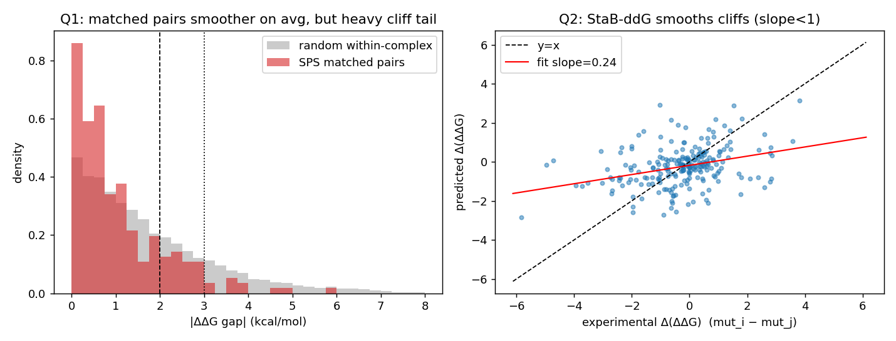
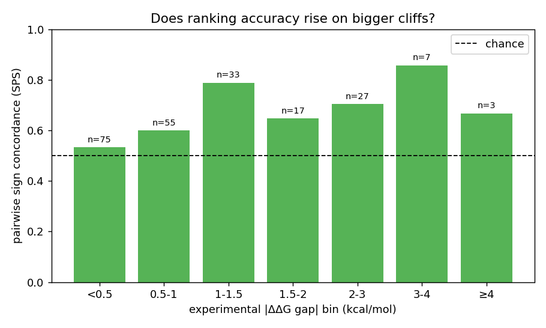

# SKEMPIv2 上的 Mutation-Cliff 分析 — StaB-ddG

> 数据来源:本仓库在 Ibex 上复现的 StaB-ddG 预测
> `ibex_records/stab-ddg_repro/eval_skempi_ft_47437925.csv`
> (paper-faithful bs=25000,test split = 界面同源簇 OOD,81 复合物 / 1491 突变)
> 复现脚本:`reproduce/mutation-analysis/mutation_cliff_analysis.py`(结果落盘 `results.json` + 两张图)

回答两个问题:
1. **SKEMPIv2(test split)上是否存在显著的 mutation cliff?**
2. **StaB-ddG 处理这种 mutation cliff 的能力如何?**

---

## 1. 什么是 mutation cliff(本文的严格定义)

借用药物化学里的 **activity cliff**(结构高度相似、活性却天差地别的一对分子)概念,把它迁移到蛋白结合上:

> **Mutation cliff = 一对"序列近邻"的突变体,其实验结合自由能变化 ΔΔG_bind 却相差很大。**

为了让"序列近邻"可严格量化,我在**同一复合物(`#Pdb`)内**构造两类 *matched mutant pair*(MMP):

| 配对类型 | 定义 | 结构语义 | 对数 |
|---|---|---|---|
| **SPS**(same-position substitution) | 两个**单点**突变,落在**完全相同的 (复合物, 链, 野生型残基, 位点)**,只有引入的氨基酸不同 | 结构语境**完全一致**,差异纯粹来自引入侧链 → 最干净的 cliff 探针 | **223** 对(110 个位点) |
| **H1**(Hamming-1) | 两个突变体的"突变 token 集合"只差一个 token(增/删一个位点,或某位点身份互换) | 把 cliff 推广到多点突变景观 | **1141** 对 |

**景观指数(SALI 类比):** `SALI_ij = |ΔΔG_i − ΔΔG_j| / d_ij`,SPS 的 `d=1`,故 SALI 即 |ΔΔG 落差|。

ΔΔG 约定沿用 SKEMPI:**负 = 突变增强结合,正 = 削弱结合**;整个 test split 的 ΔΔG 标准差 ≈ **1.91 kcal/mol**(作为"落差大小"的天然尺度)。

---

## 2. Q1 — SKEMPIv2 上存在显著的 mutation cliff 吗?

### 2.1 同位点替换(SPS)的落差分布

| 统计量 | SPS(同位点替换) | H1(汉明-1) | 随机同复合物对(基线) |
|---|---|---|---|
| 配对数 | 223 | 1141 | 18 214 |
| 落差中位数 (kcal/mol) | 0.68 | 0.95 | 1.30 |
| 落差均值 | 1.05 | 1.31 | 1.74 |
| 90 分位 | 2.45 | 2.84 | 3.81 |
| 最大落差 | **5.83** | **7.60** | 11.04 |
| **占比 ≥ 1** | 39.0% | 48.5% | 59.7% |
| **占比 ≥ 2** | **16.6%** | 23.0% | 33.4% |
| **占比 ≥ 3** | 4.5% | 8.9% | 17.7% |
| 占比 ≥ 4 | 1.3% | 3.9% | 8.7% |

### 2.2 两个看似矛盾、实则互补的发现

**(a) 平均而言,景观是"局部平滑"的,不是全局崎岖。**
SPS 落差中位数(0.68)只有随机同复合物对(1.30)的 **0.52 倍**,Mann–Whitney U 检验 **p ≈ 2.4e-13** 显著更小。也就是说:**在同一位点换一个氨基酸,平均后果确实比"随机挑两个突变"温和** —— 相近的替换倾向于产生相近的效果,序列-亲和景观存在真实的局部平滑性。这也正是 ProteinMPNN 类模型能在 per-interface 上拿到 ~0.45 Spearman 的前提。

**(b) 但尾部很重 —— cliff 作为一个少数但不可忽视的现象真实存在。**
- **16.6% 的同位点替换对落差 ≥ 2 kcal/mol(≈1 个标准差),4.5% ≥ 3,最高 5.83。**
- 按**位点**看(110 个有 ≥2 种替换的位点):**20% 的位点**其替换的 ΔΔG 跨度(max−min)≥ 2 kcal/mol,7.3% ≥ 3。
- 这些都是"同一个结构口袋、只换一个侧链"造成的能量突变,属于教科书式 cliff。

**结论(Q1):SKEMPIv2 test split 上 mutation cliff 显著存在,但属于"重尾少数"而非"普遍崎岖"。** 整体景观局部平滑(同位点替换平均比随机对温和一半),可正是这条平滑性让 cliff 在尾部格外扎眼:约 **1/6 的同位点替换对、1/5 的位点**会因单个侧链改变产生 ≥2 kcal/mol 的结合能跳变。

### 2.3 最陡的几个 SPS cliff(同位点、仅换一个氨基酸)

| 复合物 | 突变 A (exp / pred) | 突变 B (exp / pred) | exp 落差 | pred 落差 | 方向对? |
|---|---|---|---|---|---|
| 1Z7X_W_X | YW434**A** (−5.95 / −3.52) | YW434**F** (−0.12 / −0.67) | **−5.83** | −2.85 | ✅ |
| 1JTG_A_B | EA85**A** (−4.06 / **+0.48**) | EA85**G** (+0.91 / +0.65) | **−4.97** | −0.17 | ✅(几乎为0) |
| 1JTG_A_B | EA85**A** (−4.06 / **+0.48**) | EA85**V** (+0.67 / +0.43) | −4.73 | +0.05 | ❌ |
| 2G2U_A_B | DA79**K** (+0.45 / −1.38) | DA79**E** (**+4.40** / −0.16) | −3.94 | −1.23 | ✅ |
| 1KTZ_A_B | SB28**A** (−0.22 / +1.14) | SB28**L** (−4.04 / −1.98) | +3.82 | +3.12 | ✅ |
| 4CPA_A_I | VI37**G** (−3.73 / −0.80) | VI37**F** (−0.00 / +0.44) | −3.73 | −1.24 | ✅ |
| 1AO7_ABC_DE | GD28**R** (−2.32 / **+1.66**) | GD28**T** (+0.76 / +1.11) | −3.08 | +0.55 | ❌ |

典型 cliff 形态:**Tyr434→Ala 让 1Z7X 结合骤强 6 kcal/mol,而保守的 Tyr434→Phe 几乎无影响**;**EA85→Ala 强烈增强结合(−4),而 →Gly/→Val 反而轻微削弱** —— 同一位点,换个侧链,后果反号且相差 5 kcal/mol。


*左:SPS 落差分布整体比随机对偏左(更平滑),但 ≥2、≥3 kcal/mol 处仍有可观的重尾。右:见 Q2。*

---

## 3. Q2 — StaB-ddG 处理 mutation cliff 的能力

把每个 matched pair 的 **实验落差 Δexp** 与 **预测落差 Δpred** 对照,从"方向"和"幅度"两个维度评估。

### 3.1 方向:落差越大,排序越准 ✅

成对**符号一致率**(预测的 Δ 方向是否与实验一致),按实验落差分层:

| 实验落差区间 | SPS 一致率 (n) | H1 一致率 (n) |
|---|---|---|
| < 1 kcal/mol(平滑区) | 0.56 (130) | 0.61 (562) |
| 1–2 | 0.74 (50) | 0.81 (290) |
| **≥ 2(cliff)** | **0.73 (37)** | **0.88 (263)** |
| **≥ 3(强 cliff)** | **0.80 (10)** | **0.89 (102)** |



**落差越大,StaB-ddG 越能把这对突变的相对优劣排对。** 在 <1 kcal/mol 的平滑区它基本接近抛硬币(0.56),而在真正的 cliff(≥2、≥3)上一致率升到 0.73–0.89。这说明**模型对"哪个突变更糟"的方向判断,在 cliff 上是有效的**,排序能力(也正是 mutation-effect 预测最看重的)在大落差处反而最强。

### 3.2 幅度:严重压缩 cliff,典型的"过度平滑" ❌

| 指标 | SPS | H1 |
|---|---|---|
| |Δpred| 对 |Δexp| 的回归斜率 | **0.17** | 0.19 |
| 强 cliff(exp≥3)平均实验落差 | 4.03 | 4.24 |
| 强 cliff 平均**预测**落差 | **1.24** | 1.36 |
| **幅度还原率(pred/exp)** | **0.31** | 0.32 |
| 带符号落差 Spearman | 0.34 | 0.51 |
| 带符号落差 Pearson | 0.33 | 0.43 |

**模型只还原了 cliff 真实幅度的约 30%。** |Δpred|–|Δexp| 回归斜率仅 0.17–0.19(右图红线远低于 y=x),即:实验上一对突变相差 4 kcal/mol,模型平均只敢预测相差 ~1.2。这是机器学习里经典的 **activity-cliff 平滑(over-smoothing)**:模型对单残基改变给出"温吞"的响应,不敢预测剧烈跳变。

**为什么必然如此 —— 架构层面的解释:** StaB-ddG 在 SKEMPI 上是用**固定的野生型结构**经 ProteinMPNN 算各位点氨基酸对数似然,再按 StaB 参数化(复合物 − 两 binder 的折叠似然差)给分;**它从不建模突变体本身的结构后果**(空间冲突、丢失氢键/盐桥、堆积重排)。而真正的 cliff 恰恰来自这些结构后果。于是模型能从 WT 结构的"该位点偏好哪种氨基酸"读出**方向**,却无法生成 cliff 所需的**剧烈能量惩罚** → 方向对、幅度被压平。3.3 的失败案例完全印证:EA85**A** 实验 −4.06 而预测 +0.48(漏掉一个剧烈增强结合的突变);2G2U DA79**E** 实验 +4.40 而预测 −0.16(漏掉一个引入电荷的剧烈削弱);1AO7 GD28**R**(TCR/pMHC 界面)甚至预测反号。

### 3.3 同位点内部精细排序:弱 ⚠️

对有 ≥3 种替换的位点(26 个),计算**位点内** ΔΔG 预测 vs 实验的 Spearman 再跨位点平均:

- 均值 **0.25**,中位数 0.50(≥4 种替换的 10 个位点:均值 0.31)。

也就是说,**让模型在同一个固定位点上把多种替换从好到坏排序,只有微弱正相关**。结合 3.1/3.2 看:模型的判别力主要体现在**跨位点的大落差**(哪个位点、哪类突变后果严重),而**同一位点不同侧链之间的精细次序**它分辨得很有限 —— 同样源于"看不到突变体结构"。

---

## 4. 总结

**Q1:SKEMPIv2(test split)上 mutation cliff 显著存在,但是"重尾少数"而非全局崎岖。**
- 同位点单残基替换的后果**平均比随机突变对温和一半**(中位落差 0.68 vs 1.30,p≈2e-13),景观存在真实局部平滑性;
- **但尾部很重:16.6% 的同位点替换对、20% 的位点会因换一个侧链产生 ≥2 kcal/mol 的结合能跳变,最高达 5.8 kcal/mol** —— cliff 真实且不可忽视。

**Q2:StaB-ddG "方向能判、幅度压平"。**
- ✅ **方向**:落差越大排序越准,cliff(≥2)成对符号一致率 0.73(SPS)/0.88(H1),强 cliff(≥3)达 0.80/0.89,远超随机;
- ❌ **幅度**:系统性过度平滑,cliff 幅度只还原约 **30%**(回归斜率 0.17–0.19),对引入电荷/破坏堆积的剧烈单点突变常给出温吞甚至反号的预测;
- ⚠️ **同位点精细排序**弱(位点内 Spearman 均值 0.25)。
- **根因**:SKEMPI 推理只用**野生型固定结构**的 ProteinMPNN 氨基酸似然,不建模突变体结构后果,因此读得出"方向偏好"却造不出 cliff 的"剧烈能量惩罚"。

**实践启示:** StaB-ddG 适合**排序/分流**(挑出会显著增强或削弱结合的突变方向),但不应被当作 cliff 处**绝对 ΔΔG 标定器**;若要捕捉 cliff 幅度,需要引入突变体结构信息(如 FoldX/ADiT 那样对突变体重新建模),这与论文里 **StaB-ddG + FoldX 集成**能进一步提升的现象一致 —— FoldX 提供了 StaB-ddG 缺失的突变体结构能量项。

---

### 复现

```bash
conda activate stabddg
python reproduce/mutation-analysis/mutation_cliff_analysis.py
# 读取 ibex_records/stab-ddg_repro/eval_skempi_ft_47437925.csv
# 输出 results.json, fig_cliff_landscape.png, fig_concordance_by_gap.png
```
